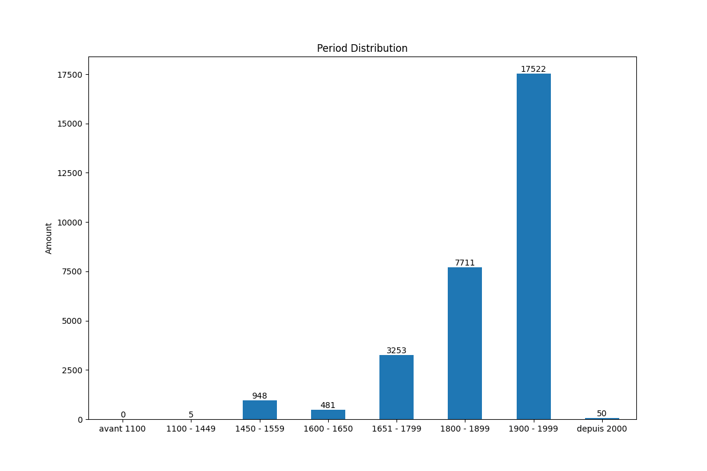

# Seminarprojekt Digitale Methoden
Dieses Repository enthält die in der Seminarprojekt verwendeten Quellcodes.

## Data
- a sufficient amount of tokenized text in the historical language of your choice
- collect a list of pairs of modern and historical words (e.g. a couple of hundreds to a thousand) 
  and try various normalization models on them
  


## Approaches
5 approaches tested

### 1. Norma
[Norma](https://github.com/comphist/norma), described in [Bollmann
  (2012)](https://marcel.bollmann.me/pub/acrh12.pdf)

Norma is a tool for automatic spelling normalization of non-standard language data. It uses a combination of different 
normalization techniques that typically require training data (= a list of manually normalized wordforms) 
and a target dictionary (= a list of valid wordforms in the target language).

[GitHub](https://github.com/comphist/norma)

- At the moment, normalizers are restricted to work with one word at a time. 
  That means they cannot take context into account or contract several words into one. 
  We're planning to build further functionality on top of the existing normalizers to enable this.

#### Environment setup
Due to the lack of 
[GFSM finite state machine library](http://kaskade.dwds.de/~moocow/mirror/projects/gfsm/)
dependency on local environment approach with docker will be used.

- build from scratch
```commandline
sudo apt update
sudo apt install build-essential
sudo apt install manpages-dev
gcc --version
sudo snap install cmake --classic
cmake --version
sudo apt install libboost-all-dev
sudo apt install pkg-config
sudo apt install libglib2.0-*
sudo apt install icu-devtools
sudo apt install doxygen
```
- docker
```commandline
docker run -v $(pwd):/home mbollmann/norma
docker run -v $(pwd):/home mbollmann/norma -s -c doc/example/example.cfg -f doc/example/fnhd_sample.txt
```

### 2. Marian (NMT) for normalization
[Marian (NMT) for normalization](https://github.com/tanggongbo/normalization-NMT),
  described in [Tang et al. (2018)](http://aclweb.org/anthology/C18-1112)

You need to install the [Marian
framework](https://github.com/marian-nmt/marian-dev) and clone [the
normalization-NMT repository](https://github.com/tanggongbo/normalization-NMT)
on your local machine.  

### 3. XNMT

[XNMT](https://github.com/neulab/xnmt), following the model of [Bollmann
  (2018)](http://www.linguistics.rub.de/forschung/arbeitsberichte/22.pdf)

XNMT is based on Python 3.6 and DyNet.  You can find detailed instructions on
how to install it [in the "Getting Started" section of the
documentation](https://xnmt.readthedocs.io/en/latest/getting_started.html).


Examples:
```commandline
sudo chmod 666 /var/run/docker.sock

xnmt examples/01_standard.yaml
```

### 4. cSMTiser

[cSMTiser](https://github.com/clarinsi/csmtiser) (wrapping Moses)

Using docker image:
```commandline
docker run -v $(pwd):/csmtiser greegorey/csmtiser python preprocess.py myconfig.yml
```

### 5. Neural Transducer

[Neural Transducer](https://github.com/peter-makarov/il-reimplementation/tree/feature/sgm2021)
described in [Makarov 2020](https://www.aclweb.org/anthology/2020.acl-main.650/)

## Devri: The diachronic dictionary of Breton
http://devri.bzh/dictionnaire/a/

The Devri site was initiated by Martial Menard in spring 2016. It currently offers the diachronic and etymological dictionary of Breton. 

This work has continued since September 2016 under the direction of Herve Le Bihan.

- no spelling variants
- sample: http://devri.bzh/dictionnaire/a/a-abadennou/
- just one spelling variant
- only one time span

- multiple variants: 
http://devri.bzh/dictionnaire/a/a-adwezh/
  
a-adwezh

filtered out samples:
a-bann
http://devri.bzh/dictionnaire/a/a-bann/

entries (variants) "b" == "i"


## Cached Website data
[Cached Data](https://mega.nz/file/7PZVAAJa#E1uTlaE0UKj8iSHRq1bMMsVg2vdOCAUkrNuAaSOuo5I)

## Norma training
Running test

```commandline
cd histnorm/
cp examples/norma.cfg ./norma.cfg
docker run -v $(pwd):/home --entrypoint norma_lexicon mbollmann/norma -w datasets/modern/combined.de.uniq -a lexicon.de.fsm -l lexicon.de.sym -c
docker run -v $(pwd):/home mbollmann/norma -c norma.cfg -f datasets/historical/german/german-anselm.train.txt -s -t --saveonexit
docker run -v $(pwd):/home mbollmann/norma -c norma.cfg -f datasets/historical/german/german-anselm.dev.txt -s > german-anselm.predictions
```

```commandline
docker run -v $(pwd):/home --entrypoint norma_lexicon mbollmann/norma -w data/period_7_words.txt -a data/period_7.fsm -l data/period_7.sym -c

```

## Corpus statics
### Amount of entities
| Period | Amount |
| --- | --- |
| avant 1100 | 0 |
| 1100 - 1449 | 5 |
| 1450 - 1559 | 948 |
| 1600 - 1650 | 481 |
| 1651 - 1799 | 3253 |
| 1800 - 1899 | 7711 |
| 1900 - 1999 | 17522
| depuis 2000 | 50 |
| Total | 29832 |



### Period #7: 17522

| Category | Amount |
| --- | --- |
| training | 10512 |
| dev | 3505 |
| test | 3505 |
| total | 17522 |

Norma:
- average character BLEU score: **54.6107**
- precision score (word accuracy): **0.3740**
- Average Character Error Rate (CER): **0.3601**

Marian:
- precision score (word accuracy): **0.5409**
- Average Character Error Rate (CER): **0.1884**


## Results

| Method | Word Accuracy | Average CER |
| --- | --- | --- |
| Norma | 0.0667 | 0.5963 |
| cSMTiser | 0.3000 | 0.2700 |
| Marian | 0.1333 | 0.6386 |
| Neural Transducer | 0.2000 | 0.3185 |


## Resources
- [Historical Text Normalization](https://github.com/coastalcph/histnorm#tldr-the-recommended-normalization-approach)
- [Neural transducer baseline](https://github.com/peter-makarov/il-reimplementation/tree/feature/sgm2021)

